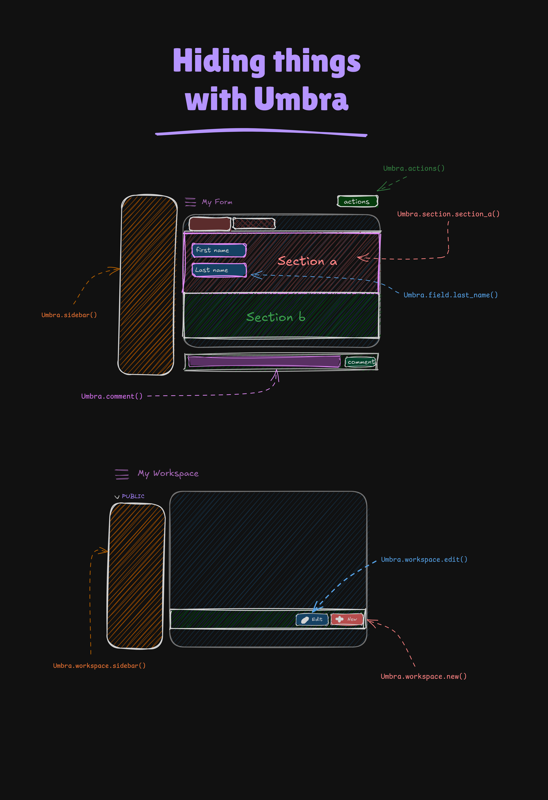

<div align="center" style="padding-bottom: 2rem;">
  <a href="https://dev.egov.gy/dev-tools/umbra" style="padding bottom: 3rem;">
    
  </a>

  <h1 align="center">Umbra JS API for Frappe</h1>

  <div align="center">
    Hide Frappe UI and Form Elements with Clean Code.
    <br>
    <br>
    <div style="text-align: justify; text-justify: inter-word;">
    Umbra is a lightweight JavaScript utility designed specifically for Frappe forms. It simplifies the process of hiding UI elements you might not need, so you can focus on building custom functionality. Whether you're a junior developer or an experienced pro, Umbra makes it easy to streamline your Frappe interfaces with minimal code.
    </div>
  </div>
</div>

<br><br>

<br><br>

---

## Table of Contents

- [Table of Contents](#table-of-contents)
- [Overview](#overview)
- [Features](#features)
- [Installation](#installation)
  - [Method 1: CDN (Recommended)](#method-1-cdn-recommended)
  - [Method 2: Git Subtree](#method-2-git-subtree)
    - [Adding Umbra.js as a Git Subtree](#adding-umbrajs-as-a-git-subtree)
    - [Referencing in hooks.py](#referencing-in-hookspy)
  - [Clear Cache](#clear-cache)
- [Usage](#usage)
  - [Actions](#actions)
  - [Timeline](#timeline)
  - [Comment Box](#comment-box)
  - [Sidebar](#sidebar)
  - [Form Fields](#form-fields)
    - [Hiding a Specific Field](#hiding-a-specific-field)
    - [Hiding Multiple Fields](#hiding-multiple-fields)
  - [Form Sections](#form-sections)
    - [Hiding Specific Section](#hiding-specific-section)
    - [Hiding Multiple Sections](#hiding-multiple-sections)
  - [Workspace](#workspace)
    - [Workspace Sidebar](#workspace-sidebar)
    - [New Workspace Button](#new-workspace-button)
    - [Edit Workspace Button](#edit-workspace-button)
  - [List View](#list-view)
    - [List View Sidebar](#list-view-sidebar)
  - [Child Table Forms (Grid Row Forms)](#child-table-forms-grid-row-forms)
    - [Hiding Table Row Controls](#hiding-table-row-controls)
    - [Hiding Table Row Form Shortcuts](#hiding-table-row-form-shortcuts)
- [Contributing](#contributing)
<!-- - [API Reference](#api-reference) -->

---

## Overview

Umbra helps you hide common UI components on Frappe forms—such as action buttons, timeline items, comment boxes, and sidebars—using a simple, consistent API. It allows you to specify conditions and permissions that determine when an element should be hidden, giving you full control over your form's appearance. It also extends to Workspaces, List Views, and Child Table (Grid) row forms.

This utility is especially useful in custom Frappe apps where you want to declutter the interface for your end users.

---

## Features

- **Simple API:** Easily hide elements with one function call.
- **Conditional Hiding:** Use callbacks to determine when elements are hidden (e.g., based on document status).
- **Role-Based Control:** Bypass hiding for users with specific roles.
- **Flexible Filtering:** Customize which timeline items are displayed, including filtering communications.
- **Broad Scope:** Hide elements in Forms, Workspaces, List Views, and Child Table row forms.
- **Forced CSS Override:** Ensures elements are hidden even if other styles override your settings.
- **Modular Design:** Separate functions and namespaces for different UI areas.
- **Easy Integration:** Manage Umbra via CDN or as a local file and reference it in your `hooks.py`.

---

## Installation

### Method 1: CDN (Recommended)

Reference the `jsdelivr` in your Frappe app’s `hooks.py` to load it on your pages:

```python
app_include_js = [
	"https://cdn.jsdelivr.net/gh/karotkriss/Umbra@latest/umbra.js",
	# Other JS files can be included here
]

```
### Method 2: Git Subtree

#### Adding Umbra.js as a Git Subtree

1. **Navigate to Your App’s root:**
	```bash
	cd path/to/your_apps/root/directory
	```

	This creates a new folder called umbra in the public folder that contains the umbra.js module.
2. **Add Umbra.js as a Subtree:**
	```bash
	git subtree add --prefix=path/to/public/js/folder/umbra https://github.com/karotkriss/Umbra.git master --squash
	```

#### Referencing in hooks.py

Reference the Umbra.js file in your Frappe app’s `hooks.py` to load it on your pages:

```python
app_include_js = [
	"/assets/your_app/js/umbra/umbra.js", # Adjust path if needed
	# Other JS files can be included here
]
```

### Clear Cache

After adding Umbra to `hooks.py`, clear the cache:
```bash
SITE_NAME=your.site.name #replace this with the name of your site
bench --site $SITE_NAME clear-cache
bench --site $SITE_NAME clear-website-cache
```

> You should now be able to use any Umbra method by calling `Umbra.[method]` client-side.
> You may also need to clear your browser cache as well.
> Refer to [Usage](#usage) for all a list methods and how to use them.

---

## Usage

Umbra is intended for use in your JavaScript files or client scripts. Here's some example usage:

```javascript
Umbra.elementToHide({props})
```

> All props (`conditional`, `permissions`, `debug`) are optional.
> You can refer to the JSDoc in the `umbra.js` file for more details.

### Actions

```javascript
Umbra.actions({ /* props */ })
```
Hide the actions button group if certain conditions are met:

```javascript
frappe.ui.form.on('YourDoctype', {
    refresh: function(frm) { // or onload
        Umbra.actions({
            conditional: cur_frm => cur_frm.doc.status === 'Draft',
            permissions: ['System Manager'], // Bypasses hiding for System Manager
            debug: true
        });
  }
});
```

### Timeline

```javascript
Umbra.timeline({ /* props */ })
```

Filter the timeline to show only specific communication items or all items:

```javascript
// Show only communications for the current user when workflow_state is Draft:
frappe.ui.form.on('YourDoctype', {
    refresh: function(frm) { // or onload
        Umbra.timeline({
            conditional: () => true, // Top-level conditional for applying any timeline changes
            filter: {
                communications: {
                    userOnly: true,
                    conditional: () => frm.doc.workflow_state === "Draft"
                }
            },
            extras: {
                hideActivitySwitch: true  // Defaults to true if not specified.
            },
            debug: true
        });
    }
});
```
Or, display all timeline items:
```javascript
frappe.ui.form.on('YourDoctype', {
    refresh: function(frm) { // or onload
        Umbra.timeline({
            filter: { all: true },
            extras: { hideActivitySwitch: true }, // Still hide the switch if needed
            debug: true
        });
    }
});
```
Or, hide the timeline completely (by not providing a filter or by a top-level conditional):
```javascript
frappe.ui.form.on('YourDoctype', {
    refresh: function(frm) { // or onload
        Umbra.timeline({ // No filter prop hides the whole timeline
            extras: { hideActivitySwitch: true },
            debug: true,
            // Or use a conditional:
            // conditional: () => frm.doc.some_condition_to_hide_timeline
        });
    }
});
```

### Comment Box
```javascript
Umbra.comment({ /* props */ })
```

Hide the comment box if certain conditions are met:

```javascript
frappe.ui.form.on('YourDoctype', {
    refresh: function(frm) { // or onload
        Umbra.comment({
            conditional: cur_frm => cur_frm.doc.status === 'Draft',
            permissions: ['System Manager'],
            debug: true
        });
    }
});
```

### Sidebar

```javascript
Umbra.sidebar({ /* props */ })
```

Hide the main form sidebar (the layout section containing the form sidebar):

```javascript
frappe.ui.form.on('YourDoctype', {
    refresh: function(frm) { // or onload
        Umbra.sidebar({
            conditional: cur_frm => cur_frm.doc.status === 'Draft',
            permissions: ['System Manager'],
            debug: true
        });
    }
});
```

### Form Fields

Requires `Utils.js` (from `https://github.com/karotkriss/Utils`) to be included in your app.

#### Hiding a Specific Field
```javascript
Umbra.field.name_of_desired_field({ /* props */ })
```

Hide the field "my_field" if the document status is 'Draft' and the current user is not a System Manager.
```javascript
frappe.ui.form.on('YourDoctype', {
    refresh: function(frm) { // or any suitable event
        Umbra.field.my_field({
            conditional: (cur_frm) => { return cur_frm.doc.status === "Draft"; },
            permissions: ["System Manager"],
            debug: true
        });
    }
});
```

#### Hiding Multiple Fields
```javascript
Umbra.fields({ fields: ["field1", "field2"], /* props */ });
```

Hide multiple fields "middle_name" and "salary" with conditional logic if the current user is not the owner/creator of the form.
```javascript
frappe.ui.form.on('YourDoctype', {
    refresh: function(frm) { // or any suitable event
        Umbra.fields({
            fields: ["middle_name", "salary"],
            conditional: (frm) => {
                return frappe.session.user !== frm.doc.owner;
            },
            permissions: ["System Manager"], // Example: System Manager can always see
            debug: true
        });
    }
});
```

### Form Sections

Requires `Utils.js` (from `https://github.com/karotkriss/Utils`) to be included in your app.

#### Hiding Specific Section
```javascript
Umbra.section.name_of_desired_section({ /* props */ })
```

Hide the section "my_section" (which is a "Section Break" field) if the document status is 'Draft' and the current user is not a System Manager.
```javascript
frappe.ui.form.on('YourDoctype', {
    refresh: function(frm) { // or any suitable event
        Umbra.section.my_section_break_field_name({
            conditional: (cur_frm) => { return cur_frm.doc.status === "Draft"; },
            permissions: ["System Manager"],
            debug: true
        });
    }
});
```

#### Hiding Multiple Sections
```javascript
Umbra.sections({ sections: ['section_break_1', 'section_break_2'], /* props */ })
```

Hide sections if the document status is 'Draft' and the current user is not a System Manager.
```javascript
frappe.ui.form.on('YourDoctype', {
    refresh: function(frm) { // or any suitable event
        Umbra.sections({
            sections: ['section_break_nmki', 'section_break_3ki7'],
            conditional: (cur_frm) => { return cur_frm.doc.status === "Draft"; },
            permissions: ["System Manager"],
            debug: true
        });
    }
});
```
	 
### Workspace

> :information_source: The following functions are intended to be used in any one of your `app_included_js` files that load on workspace pages. They typically run inside a `$(document).ready()` or similar DOM ready check.

#### Workspace Sidebar
```javascript
Umbra.workspace.sidebar({ /* props */ })
```
Hide Workspace sidebar:
```javascript
// In a global JS file included via hooks.py
$(document).ready(() => {
    if (frappe.get_route_str().startsWith("app/workspace")) { // Check if on a workspace page
        Umbra.workspace.sidebar({
            // conditional: () => !frappe.user.has_role("Workspace Manager"), // Example
            permissions: ["Administrator"], // Bypasses for Admin
            debug: true
        });
    }
});
```

#### New Workspace Button
```javascript
Umbra.workspace.new({ /* props */ })
```
Hide New Workspace Button:
```javascript
// In a global JS file
$(document).ready(() => {
    if (frappe.get_route_str().startsWith("app/workspace")) {
        Umbra.workspace.new({
            permissions: ["Workspace User"], // Only non "Workspace User" will have it hidden
            debug: true
        });
    }
});
```

#### Edit Workspace Button
```javascript
Umbra.workspace.edit({ /* props */ })
```
Hide Edit Workspace Button:
```javascript
// In a global JS file
$(document).ready(() => {
    if (frappe.get_route_str().startsWith("app/workspace")) {
        Umbra.workspace.edit({
            conditional: () => {
                // Example: Hide if current workspace name is "Public Workspace"
                // This requires logic to get current workspace context, which can be complex.
                // Simpler conditions based on user roles are more common here.
                return $('.page-title-text[data-original-title="Public Workspace"]').length > 0;
            },
            permissions: ["System Manager"],
            debug: true
        });
    }
});
```

### List View

> :information_source: The following function is typically called within the `onload` event of `frappe.listview_settings` for a specific DocType, or in a global script checking the route.

#### List View Sidebar
```javascript
Umbra.list.sidebar({ /* props */ })
```
Hide List View sidebar for a specific DocType:
```javascript
frappe.listview_settings['Your DocType'] = {
    onload(listview) {
        Umbra.list.sidebar({
            // conditional: () => !frappe.user.has_role("List Manager"), // Example
            permissions: ["Administrator"], // Bypasses for Admin
            debug: true
        });
    }
};
```
Or globally for all list views (use with caution, place in a global JS file):
```javascript
$(document).ready(() => {
    if (frappe.get_route_str().startsWith("app/list")) {
        Umbra.list.sidebar({ debug: true });
    }
});
```

### Child Table Forms (Grid Row Forms)

The `Umbra.table.form` namespace provides utilities to hide elements within the expanded form view of a child table row (grid row). These are typically used within the `[child_table_fieldname]_on_form_rendered` event.

#### Hiding Table Row Controls
```javascript
Umbra.table.form.controls({ /* props */ })
```
Hides the action controls (like "Insert Above/Below", "Move") for a child table row. Does not hide "Delete Row" or "Collapse Row" buttons.

```javascript
frappe.ui.form.on('YourParentDocType', {
    // Assuming 'items' is the fieldname of your child table
    items_on_form_rendered: function(frm, cdt, cdn) {
        Umbra.table.form.controls({
            conditional: () => frm.doc.status === 'Submitted', // Hide controls if parent is submitted
            permissions: ['System Manager'], // System Manager can still see them
            debug: true
        });
    }
});
```

#### Hiding Table Row Form Shortcuts
```javascript
Umbra.table.form.shortcuts({ /* props */ })
```
Hides the footer toolbar in the child table row form that displays keyboard shortcuts.

```javascript
frappe.ui.form.on('YourParentDocType', {
    // Assuming 'items' is the fieldname of your child table
    items_on_form_rendered: function(frm, cdt, cdn) {
        Umbra.table.form.shortcuts({
            // conditional: () => true, // Always hide, or add condition
            debug: true
        });
    }
});
```

---
## Contributing

Contributions are welcome! Please follow these guidelines:

- Fork the repository: Create your own branch for your changes.
- Write clear code: Follow the existing style and include comments.
- Update the README: If you add features, update the documentation.
- Submit a pull request: Provide a clear description of your changes.

---

Umbra is designed to streamline your Frappe development process by making it easier to hide unwanted UI elements. With its modular design and simple integration, Umbra is an ideal utility for developers of all skill levels. Give it a try and see how much cleaner your custom Frappe interfaces can become!